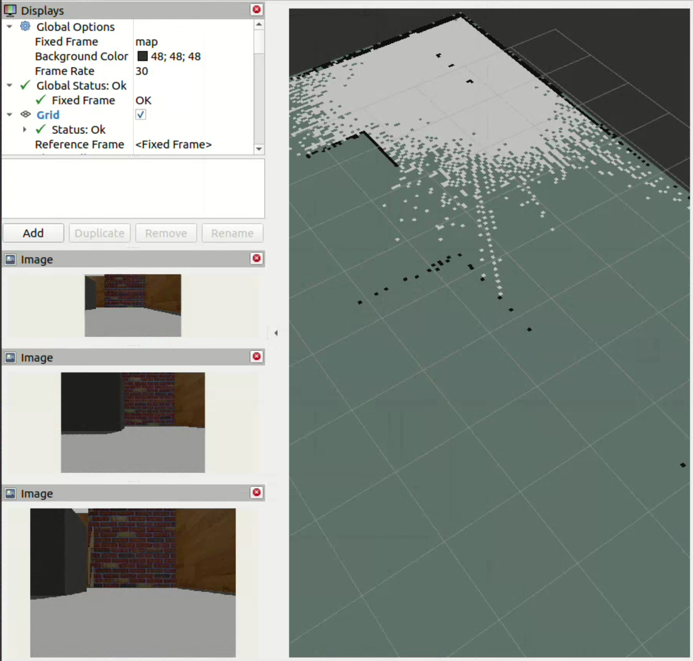
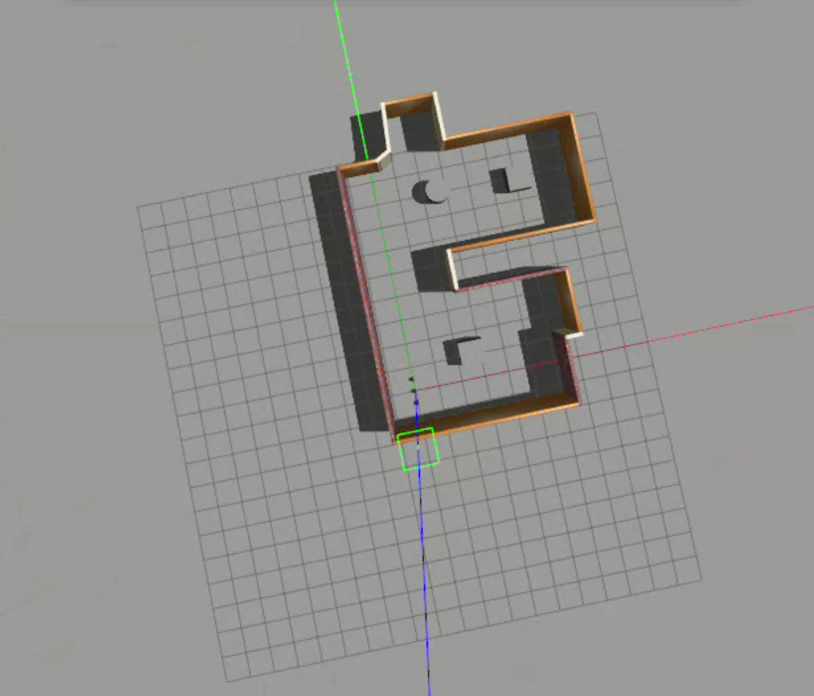
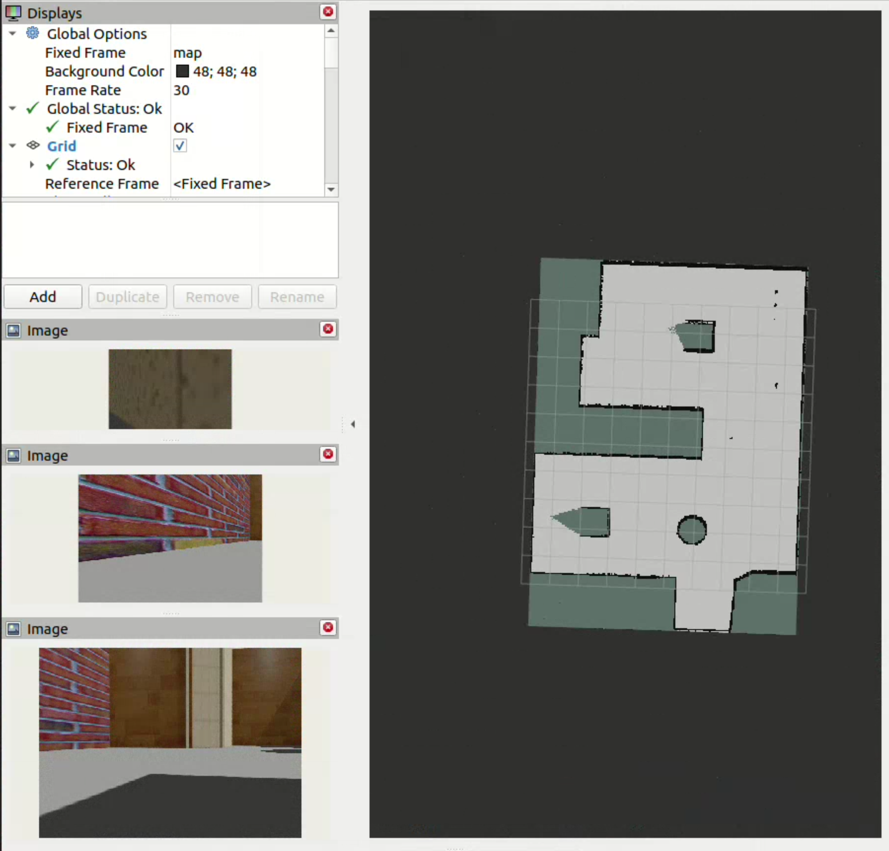

# Multi-Robot-Collaborative-Mapping

## Overview

<text style="font-size: 16px;">The problem statement requires a map-merging solution for swarm robots to collaboratively build a unified map of an unknown environment.


<p align="center">


<br>
Multiple Spawned bots
</p>

<p align="center">

<br>
Merged Map
</p>

## Setup Instructions

The system requirements are same as that of [tortoisebot](https://github.com/rigbetellabs/tortoisebot/tree/ros2-humble)

<text style="font-size: 16px;">1\. Install requirements

```bash
sudo apt install ros-humble-joint-state-publisher ros-humble-robot-state-publisher ros-humble-cartographer ros-humble-cartographer-ros ros-humble-gazebo-plugins ros-humble-teleop-twist-keyboard  ros-humble-teleop-twist-joy ros-humble-xacro ros-humble-nav2* ros-humble-urdf 
```

- Nav2 Install
```bash
sudo apt install ros-humble-navigation2
sudo apt install ros-humble-nav2-*
```
- SLAM Install
```bash
sudo apt install ros-humble-slam-toolbox
```
<text style="font-size: 16px;">3\. Install dependencies

```bash
cd ~/Team_id_53/
colcon build
echo "source ~/Team_id_53/install/setup.bash" >> ~/.bashrc
```

<br>

# Deployment


<text style="font-size: 16px;">1\. Launch frame_changer for each bot:  


```bash
cd ~/Team_id_53/
python3 tortoisebot/multiple_spawner/launch/slam_launcher.py --num_bots=3 --x_pose 0.0 0.0 0.0 --y_pose 0.0 0.5 -0.5
```

<text style="font-size: 16px;">2\. Spawn the bots:

```bash
python3 tortoisebot/multiple_spawner/launch/spawn_bots.py --num_bots=3 --x_pose 0.0 0.0 0.0 --y_pose 0.0 0.5 -0.5
```


<text style="font-size: 16px;">3\. Teleop the robots:

```bash
ros2 run teleop_twist_keyboard teleop_twist_keyboard cmd_vel:=/bot_<bot_id>/cmd_vel
```
where bot_id is the id of the bot you want to control, between 0 till num_bots-1

<text style="font-size: 16px;">4\. To save the map:

```bash
ros2 run nav2_map_server map_saver_cli -f ~/Team_id_53/merge_map
```

# Directory Structure

```bash
$HOME
└── Team_id_53
    ├── demo_small_world.webm
    ├── README.md
    └── tortoisebot
        ├── frame_changer
        ├── map_merge
        ├── multiple_spawner
        ├── README.md
        ├── tortoisebot_bringup
        ├── tortoisebot_control
        ├── tortoisebot_description
        ├── tortoisebot_firmware
        ├── tortoisebot_gazebo
        ├── tortoisebot_imu
        ├── tortoisebot_navigation
        ├── tortoisebot_slam
        ├── v4l2_camera
        ├── ydlidar_ros2_driver
        └── YDLidar-SDK

```

# How does it work
<text style="font-size: 16px;">Our solution implements a parameterized launch file that can be used to spawn any number of bots in different locations. It the assigns each robot a namespace to independently manage its own SLAM and navigation stack. The map-merge node is responsible for merging the maps of all the robots. The robots are teleoped using the teleop_twist_keyboard node and finally the map is saved using the map_saver_cli node.


# Resources


<text style="font-size: 16px;">2\. SLAM Toolbox<br>

-   https://github.com/SteveMacenski/slam_toolbox.git

<text style="font-size: 16px;">3\. Tortoisebot<br>

-   https://github.com/rigbetellabs/tortoisebot

<text style="font-size: 16px;">4\. Map-Merge<br>

-   https://github.com/robo-friends/m-explore-ros2.git

<text style="font-size: 16px;">4\. Map-Merge review<br>

-   https://wiki.ros.org/multirobot_map_merge


# Notes

<text style="font-size: 16px">This project was built and tested on a system with following specifications:

 - Intel Core i7-12650H Processor
 - 16GB RAM
 - Nvidia RTX 4060 Laptop GPU - 8GB VRAM
 - NVIDIA Driver 535.183.01
 - NVIDIA CUDA Toolkit 12.2
 - OS: Ubuntu 22.04 LTS
 - ROS2 Humble
 - Gazebo Classic
 - Python 3.10.12

